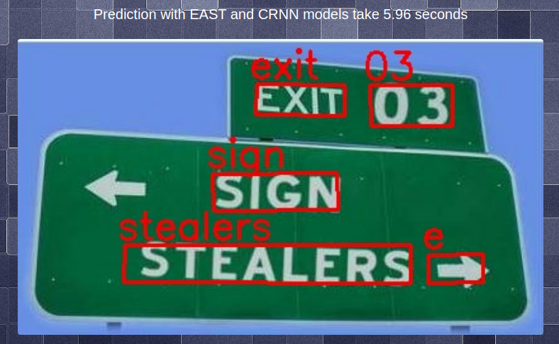
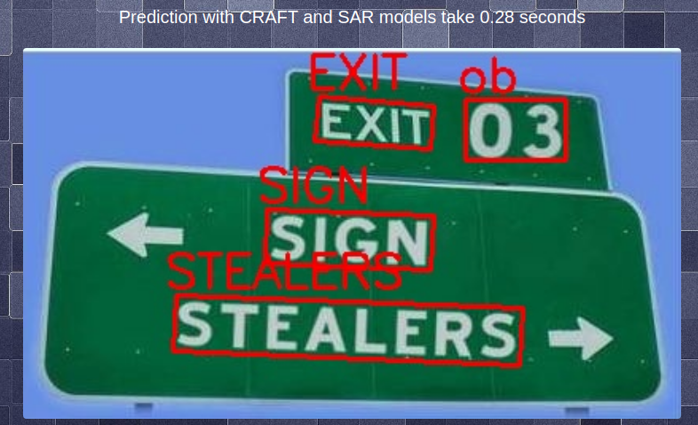
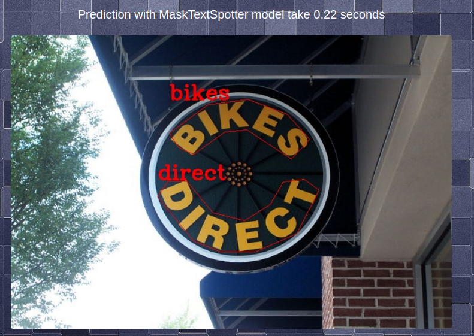

### This is simple web-application for comparing different approaches in text recognition task.
###### Web-application was written with Bootstrap 4 and flask-restful framework.

## Task overview
Text recognition task usually dividing into two main approaches: where text detection and recognition is performed by different models, and where this task performed by one model (end-to-end approach).
For text detection and text recognition different models can be used.
In this repository I have used few models:
- [EAST](https://arxiv.org/pdf/1704.03155v2.pdf) and [CRAFT](https://arxiv.org/pdf/1904.01941v1.pdf) for text detection;
- [CRNN](http://arxiv.org/abs/1507.05717) and [SAR](https://arxiv.org/pdf/1811.00751.pdf) for text recognition;
- [Mask TextSpotter](https://arxiv.org/pdf/1807.02242.pdf) as end-to-end approaches.

## Application running
### For correct running of the application you have to follow next steps:
#### 1. Recursively clone repository. This step is require for cloning all submodules which was used.
```
git clone --recursively https://github.com/hontarenkoYana/text-recognition.git
cd text-recognition
```
#### 2. Create virtual environment for prevent errors and project isolation from other system libraries.
```
python3 -m venv tr-venv
source tr-venv/bin/activate
```
#### 3. Download all needed data
- [Syn90K](https://www.robots.ox.ac.uk/~vgg/data/text/);
- [CRNN weights](https://www.dropbox.com/sh/y4eaunamardibnd/AAB4h8NkakASDoc6Ek4knEGIa?dl=0);
- [CRAFT weights](https://drive.google.com/open?id=1Jk4eGD7crsqCCg9C9VjCLkMN3ze8kutZ);
- [EAST weights](https://github.com/oyyd/frozen_east_text_detection.pb);
- [Mask TextSpotter weights](https://drive.google.com/open?id=1pPRS7qS_K1keXjSye0kksqhvoyD0SARz).
#### 4. Create required `data` folder and copy needed files to it.
1. Copy CRNN weights in the folder `/<copied-repository-full-path>/data/crnn-pretrained`.
2. Copy CRAFT weights in the folder `/<copied-repository-full-path>/data/craft-model`.
3. Copy EAST weights in the folder `/<copied-repository-full-path>/data/east-model`.
4. Copy Mask TextSpotter weights in the folder `/<copied-repository-full-path>/data/masktextspotter-model`.
5. Unarchive Syn90K data in  the folder `/<copied-repository-full-path>/data`.
6. Copy dicts `char_dict_en.json` and `ord_map_en.json` from `/<copied-repository-full-path>/CRNN_Tensorflow/data/char_dict` to the `/<copied-repository-full-path>/data/crnn-dicts`.
7. Copy `/<copied-repository-full-path>/MaskTextSpotter/configs/finetune.yaml` file to the `/<copied-repository-full-path>/data/masktextspotter-config` folder.
#### 5. Install all requirements.
```
pip install -r requirements.txt
```
#### 6. Prepare data for training SAR model with following command.
```
python custom/divide_syn90k_data.py
```
#### 6. Last step before running web-application is training SAR model.
For model training you have go to this submodule and add following lines to the start of the `train.py` file.
```
import sys
sys.path.append("/<copied-repository-full-path>/sar-pytorch")
```
After this you can train SAR model with following command:
```
mkdir ../data/sar-models
python train.py --batch 32 --epoch 5000 --dataset ./syn90k --dataset_type syn90k --gpu True --output ../data/sar-models
```
This was final step!
After this your data folder have to looks like this:

<pre>...
├── data
│   ├── craft-model
│   │   └── craft_mlt_25k.pth
│   ├── crnn-dicts
│   │   ├── char_dict_en.json
│   │   └── ord_map_en.json
│   ├── crnn-pretrained
│   │   ├── checkpoint
│   │   ├── shadownet.ckpt-80000.data-00000-of-00001
│   │   ├── shadownet.ckpt-80000.index
│   │   └── shadownet.ckpt-80000.meta
│   ├── east-model
│   │   └── frozen_east_text_detection.pb
│   ├── masktextspotter-config
│   │   └── finetune.yaml
│   ├── masktextspotter-model
│   │   └── model_finetune.pth
│   ├── mjsynth
│   │   └── Syn90K-extracted-data
│   ├── sar-models
│   │   └── model_best.pth
│   └── syn90k
│   │   ├── train
│   │   └── test
...
</pre>
### Now you can run application. You have to go to the folder above and run following command:
```
python app.py
```
### Some testing results:




